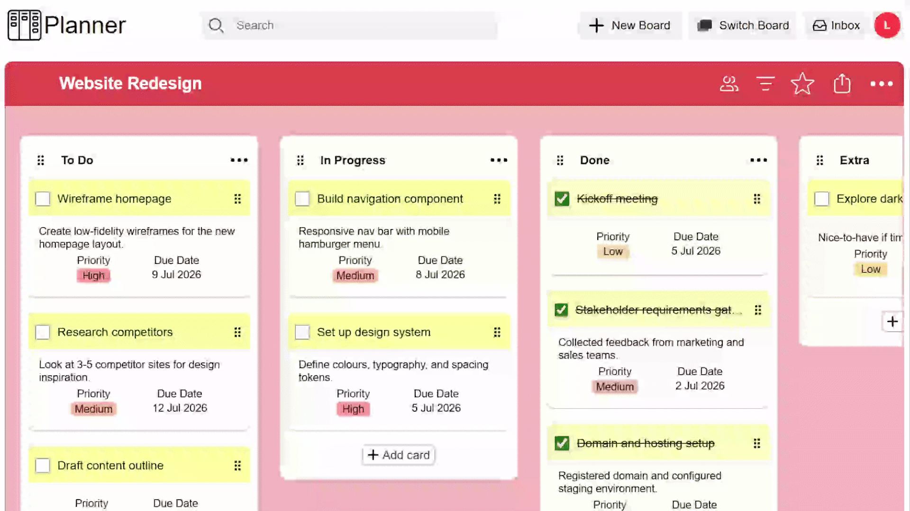

# Planner - Kanban Web App

A modern Trello-inspired Kanban application built with **Next.js** and **ASP.NET Core**, featuring drag-and-drop task management, real-time collaboration, authentication, and a responsive user interface.

---

## 🌐 Live Demo

> https://plannerexample.co.uk/

---

## Preview

 

---

##  Features

- 📋 Create and manage multiple boards
- 📂 Create, rename, reorder, and delete lists
- 📝 Create, edit, move, and delete cards
- 🎯 Smooth drag-and-drop for lists and cards using **dnd-kit**
- 🔍 Search cards by keyword
- 👥 Invite and manage board members
- 🔐 Secure user authentication with JWT
- ⚡ Real-time updates using SignalR
- 📱 Responsive design for desktop and tablet
- ☁️ Deployed on a Linux VPS

---

## 🛠 Tech Stack

### Frontend

- Next.js
- React
- TypeScript
- dnd-kit
- CSS Modules

### Backend

- ASP.NET Core Web API
- Entity Framework Core
- MySQL
- SignalR
- JWT Authentication

### Infrastructure

- Ubuntu VPS
- Nginx Reverse Proxy
- Kestrel
- PM2 (Next.js process manager)

---

##  Real-Time Features

SignalR is used to synchronize updates across connected clients, allowing users to see changes without refreshing the page.

Examples include:

- Card updates
- List changes
- Drag-and-drop synchronization
- Board modifications

---

## What I Learned

Building this project helped me gain experience with:

- Full-stack application architecture
- ASP.NET Core Web API development
- Entity Framework Core
- MySQL database design
- JWT authentication and authorization
- SignalR real-time communication
- Complex drag-and-drop interactions with dnd-kit
- Linux server deployment
- Nginx reverse proxy configuration
- HTTPS with Let's Encrypt
- Production environment configuration and deployment

---
